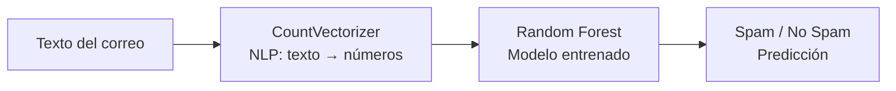
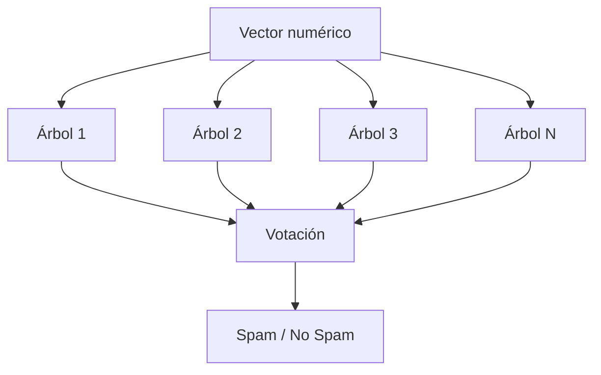

# Detector de Spam: mlspam

Aplicación web de **Inteligencia Artificial** que clasifica automáticamente correos electrónicos como **spam** o **no spam** utilizando técnicas de **Procesamiento del Lenguaje Natural (NLP)**.

> **Prueba la app en vivo:** [mlspam.streamlit.app](https://mlspam.streamlit.app/)

---

## 📋 Tabla de Contenidos

- [Foco](#foco)
- [Descripción General](#descripción-general)
- [Cómo Funciona el Sistema](#cómo-funciona-el-sistema)

---

## Foco

*La interfaz permite escribir o pegar un correo y obtener una clasificación instantánea con porcentaje de confianza.*

---

## Descripción General

**ML Spam Detector** es una aplicación web que utiliza **Inteligencia Artificial** y **NLP** para analizar el texto de los correos electrónicos y determinar si son spam o legítimos.

### NLP
- Para entender si un correo es spam o no, el modelo debe procesar el lenguaje: palabras, frases, estructuras. Eso es exactamente lo que hace el **Procesamiento del Lenguaje Natural**.

### El sistema es **100% IA y NLP** porque:
- Procesa lenguaje natural (correos electrónicos)
- Usa un algoritmo de **Machine Learning** (Random Forest)
- Aprende de datos históricos para hacer predicciones

---

### El flujo de procesamiento consta de 3 pasos clave:

- Ejemplo de correo: La contraseña temporal es 12345 (cámbiala al entrar).
- Vectorización (NLP): El texto se convierte en números utilizando CountVectorizer. Cada palabra única se convierte en una característica numérica.
- Predicción (IA): El modelo Random Forest analiza los patrones numéricos y decide si el correo es spam o no.
- Optimización: El modelo fue optimizado automáticamente con GridSearchCV para encontrar la mejor configuración de hiperparámetros.

## Cómo Funciona el Sistema

El corazón de esta aplicación es un pipeline de **Inteligencia Artificial** que combina **NLP** y **Machine Learning**. El proceso consta de 3 etapas clave:

### 1️⃣ Vectorización (NLP): De texto a números

Las máquinas no entienden palabras, solo números. Por eso, el primer paso es **traducir el texto del correo a una representación numérica**.

**¿Cómo lo hacemos?**  
Usamos `CountVectorizer`, una herramienta de NLP que:

- Cuenta cuántas veces aparece **cada palabra única** en el correo.
- Crea un **vector numérico** donde cada posición representa una palabra del diccionario.

#### Ejemplo visual:

| Correo | Vector (simplificado) |
|--------|----------------------|
| *"Gane dinero rápido"* | [1, 1, 1, 0, 0, ...] |
| *"Reunión de trabajo"* | [0, 0, 0, 1, 1, ...] |

> 🧠 **Concepto clave:** Cada palabra única es una **característica (feature)**. El vector resultante es la "huella digital" numérica del correo.

---

### 2️⃣ Predicción (IA): El modelo analiza y decide

Una vez que el texto es numérico, el **modelo de IA** puede procesarlo. En este caso, usamos **Random Forest**, un algoritmo de aprendizaje automático que:

- Está, en este caso, entrenado con **dosmil de ejemplos** de correos (spam y no spam).
- Aprende **patrones complejos** en los datos numéricos.
- Toma una decisión basada en la combinación de **muchos árboles de decisión**.

#### ¿Por qué Random Forest?
- Es **robusto y preciso** para problemas de clasificación de texto.
- Maneja bien la alta dimensionalidad (muchas palabras).
- Da resultados **interpretables** (podemos saber qué palabras influyen más).

